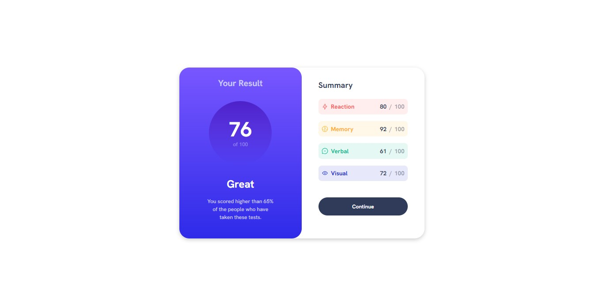

# Frontend Mentor - Results summary component

# Run Vite Site

### npm run dev

## Table of contents

- [Overview](#overview)
  - [The challenge](#the-challenge)
  - [Screenshot](#screenshot)
  - [Links](#links)
- [My process](#my-process)
  - [Built with](#built-with)
  - [Continued development](#continued-development)
- [Author](#author)

## Overview

### The challenge

Users should be able to:

- View the optimal layout for the interface depending on their device's screen size
- See hover and focus states for all interactive elements on the page

### Screenshot

### Links

- Solution URL: [Solution URL](https://github.com/legonnexon/Results-Summary)
- Live Site URL: [Live site URL](https://legonnexon.github.io/Results-Summary/)

## My process

### Built with

- Semantic HTML5 markup
- CSS custom properties
- Flexbox
- CSS Grid
- Mobile-first workflow
- [React](https://reactjs.org/) - JS library

### Continued development

I want make mobile version

## Author

- Website - [Github Profile](https://github.com/legonnexon)
- Frontend Mentor - [@legonnexon](https://www.frontendmentor.io/profile/legonnexon)
- Instagram - [@lobinhojbl](https://www.instagram.com/lobinhojbl/)
